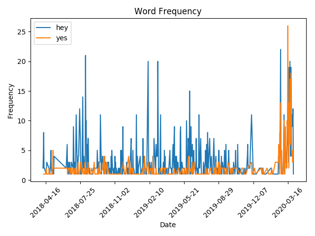
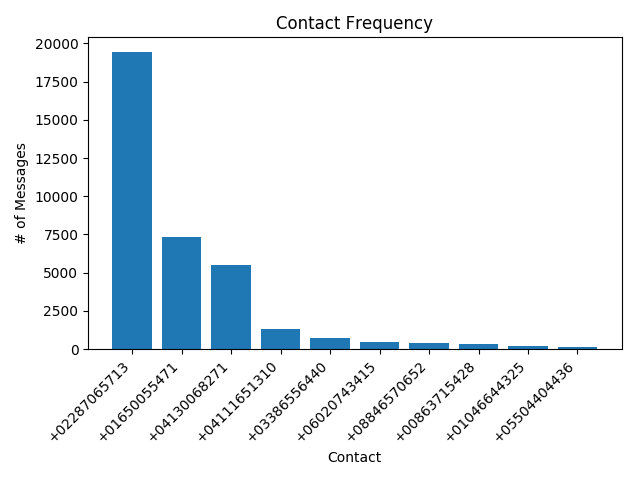
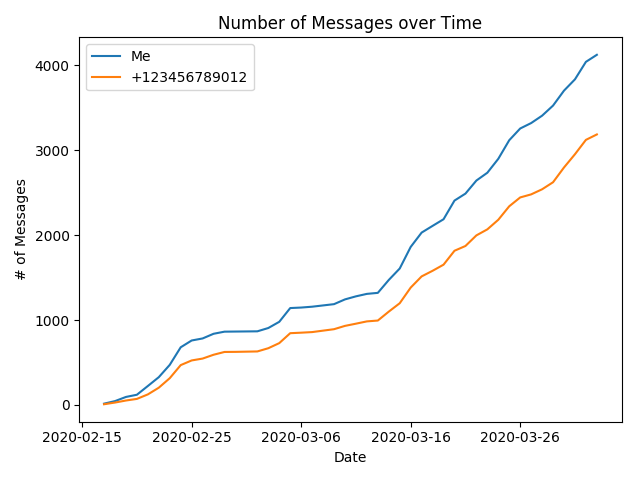
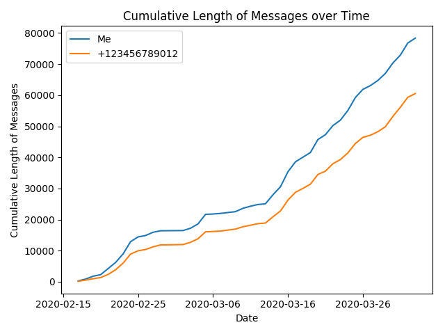
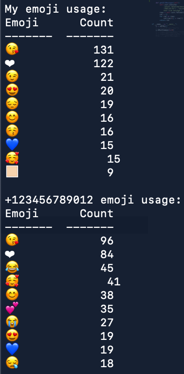

# iMessageAnalyzer
Package to perform analysis on iMessages in Mac database

To instantiate the class:
```
from imessage import sqlObj
s = sqlObj()
```

# Word Frequency
In order to see the frequency of words and/or characters over time:
```
s.keywordFreq(keywords=["hey","yes"],number="+12345679012")
```


# Most Common Contacts
In order the see the K most common contacts in iMessage:
```
s.kMostCommon(k=10)
```


If the number argument is left blank, the frequency analysis will be performed on all numbers in the database

# Messages Sent/Received
In order to compare the number of messages sent to and received by a number:
```
s.compareMessageNums(number="+12345679012")
```


# Messages Sent/Received Length
In order to compare the length of messages sent to and received by a number:
```
s.compareMessageLength(number="+12345679012")
```


# Emoji Frequency
In order to see the most frequently used emojis sent to and received by a number:
```
s.mostCommonEmojis(number="+123456789012")
```


(matplotlib has issues plotting emojis, so output is printed to the terminal)
