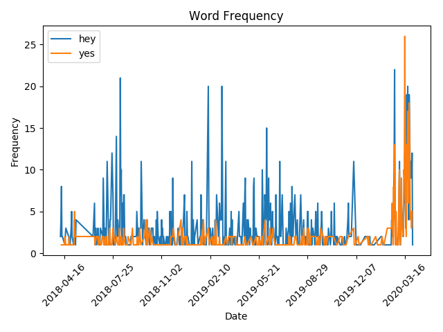

# iMessageAnalyzer
Package to perform analysis on iMessages in Mac database

# Analyze word frequency
Call the class function `keywordFreq` in order to see the frequency of words and/or characters over time:
```
from imessage import sqlObj
s = sqlObj()
s.keywordFreq(["hey","yes"],number="+12345679012")
```

If the number argument is left blank, the frequency analysis will be performed on all numbers in the database
